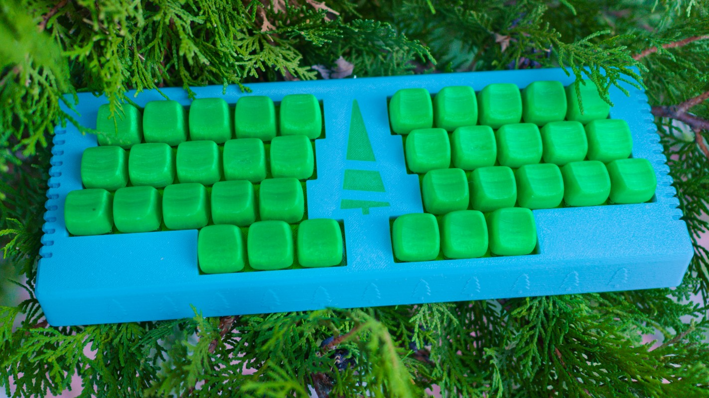
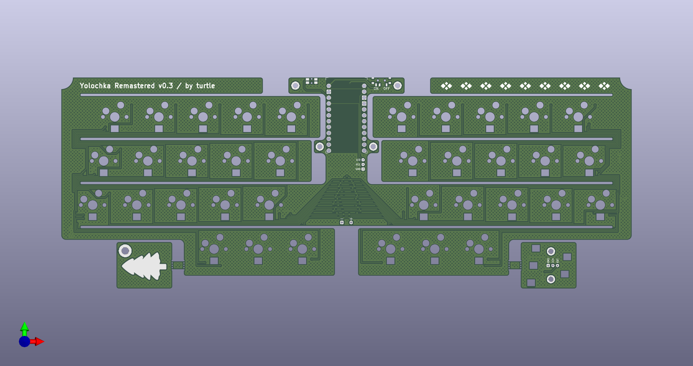
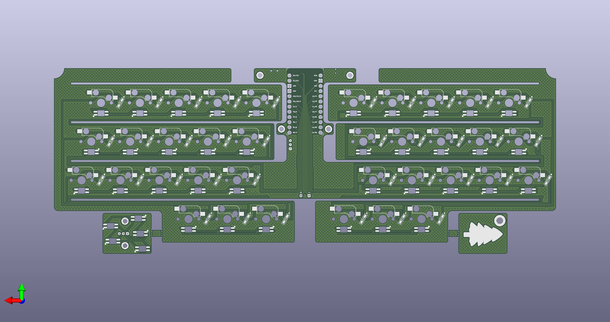

# Yolochka Remastered

Yolochka Remastered is a 36 keys (3x5 + 3 thumbs per hand) row staggered keyboard, inspired by [Aroum's YOLOCHKA](https://github.com/aroum/yolochka). It started as an attempt to turn the original YOLOCHKA into a PCB-based design.

## Images

## PCB Images

## Bill Of Materials

| Item                       | Quantity | Remarks                                                   |
| ---------------------------|----------| ----------------------------------------------------------|
| NRFproMicro                | 1        | [Link](https://aliexpress.com/item/1005007088422530.html) |
| MX Style Mechanical Switch | 36       | Any green themed colors, but works any, see below         |
| MX HotSwap Socket          | 36       | Any MX Compatible, but green preferred                    |
| SMD Diode 1n4148 SOD123    | 36       | If you can find green or red is good                      |
| SK6812MINI-E               | 41       |                                                           |
| MSK12C02                   | 1        | Power switch                                              |
| EVQP7C01K                  | 1        | Reset switch                                              |
| 14500 li-ion battery       | 2        |                                                           |
| 24 AWG wire                |          | Or something similar                                      |
| M2 threaded insert         | 11       | 3mm, OD 3.2mm                                             |
| M2x4                       | 2        | For led panel                                             |
| M2x10                      | 4        | For PCB                                                   |
| M2x5                       | 7        | For Case                                                  |

## Firmware

## License

